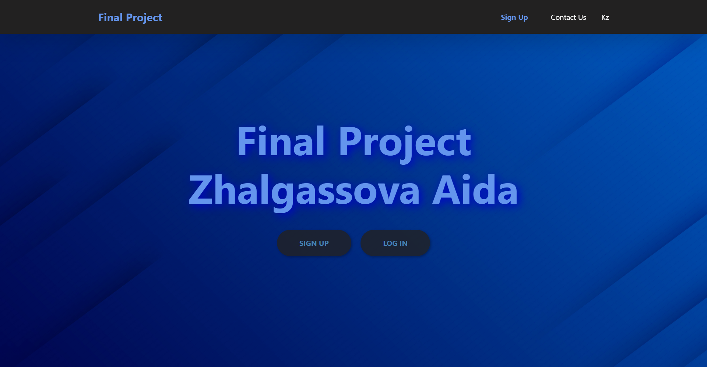
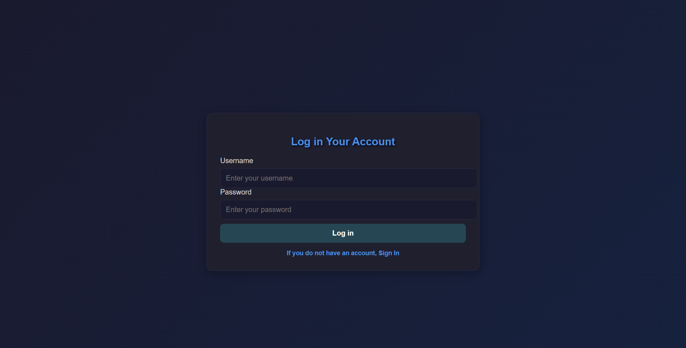
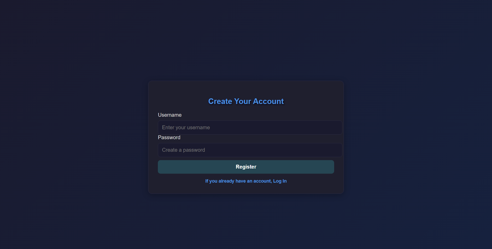
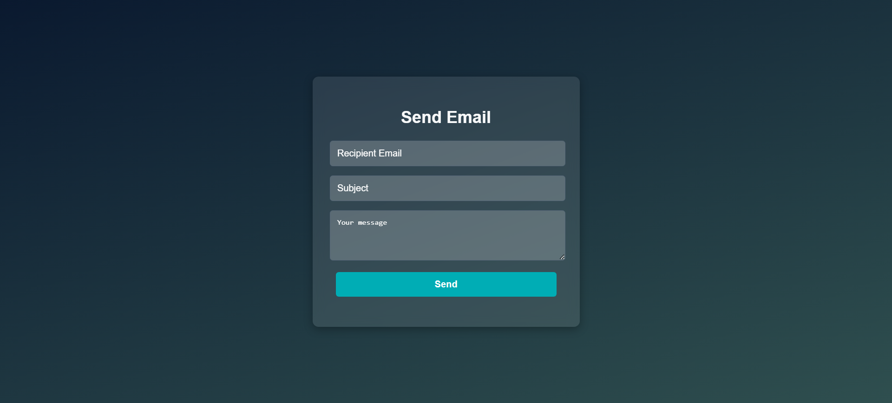
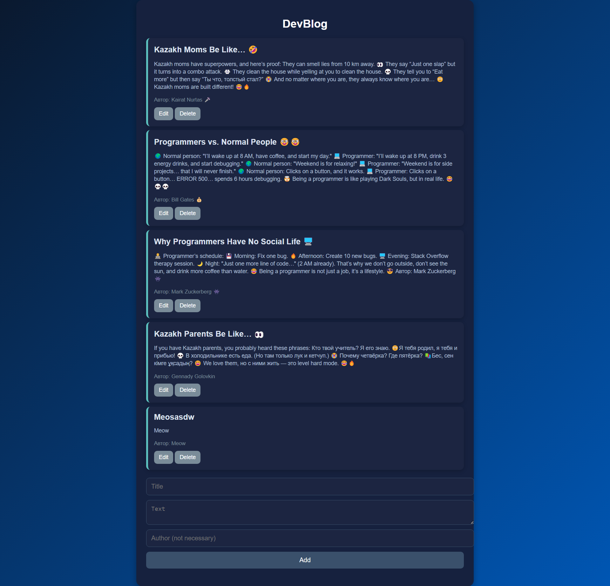
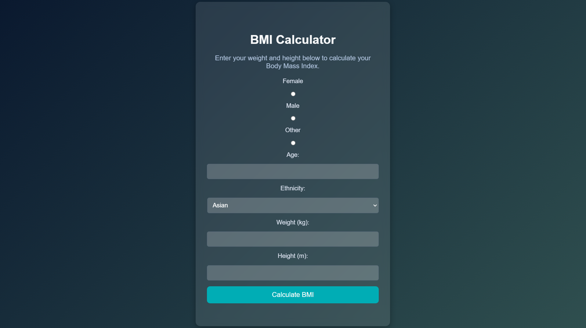
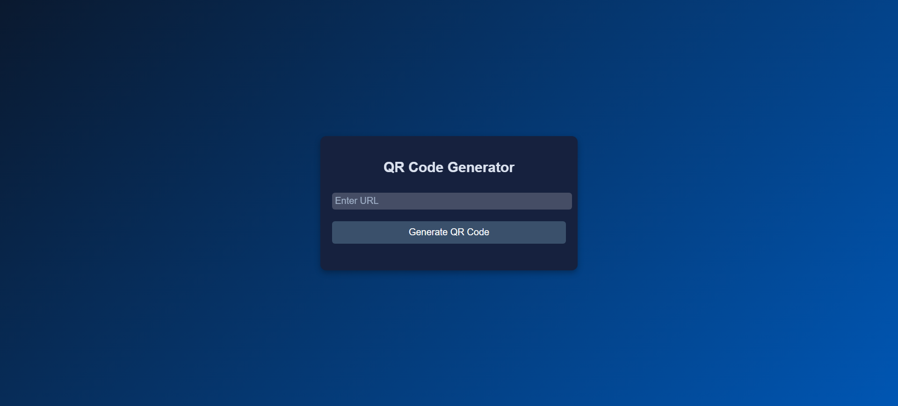
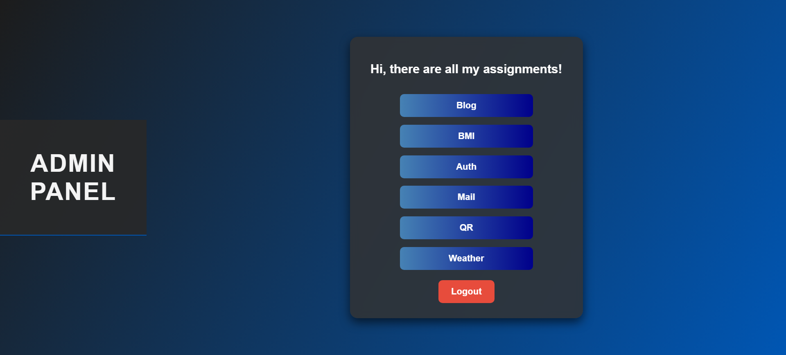

# 🌐 Final Project - WEB Technologies

  
  

## 📌 Project Overview
This is the final project for the WEB Technologies course, where multiple features have been integrated, including:

- ✅ QR Code Generator
- ✅ Nodemailer (Email Sending)
- ✅ BMI Calculator
- ✅ Weather API
- ✅ Login Form
- ✅ CRUD Operations

## 📸 Screenshots

### 🏠 Home Page

### 🔑 Login Page

### 📝 Register Page

### 📩 Email Service (Nodemailer)

### 📰 Blog Section

### 📊 BMI Calculator

### 🌦️ Weather API

### 🔍 QR Code Generator

### 🛠️ Admin Panel

---  
✨ *Developed with dedication and hard work!* ✨
